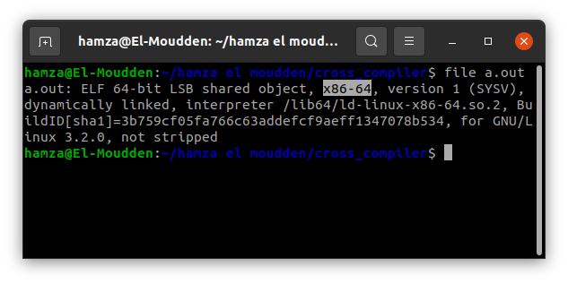
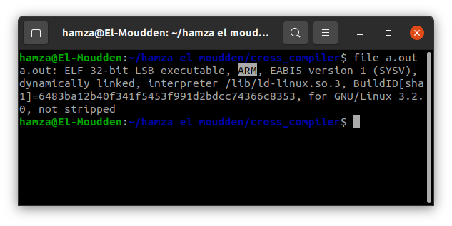

# cross_compiler
La compilation croisée fait donc référence aux chaînes de compilation
capables de traduire un code source en code objet dont l’architecture
processeur diffère de celle où la compilation est effectuée. Ces chaînes sont
principalement utilisés en informatique industrielle et dans les systèmes
embarqués

## Contents
+ [Introduction](#cross_compiler)
+ [gestion des étudiants en langage c](#gestion-des-étudiants-en-langage-c)
+ [Préparation du Toolchain](#Préparation-du-Toolchain)
+ [normal compiler](#normal-compiler)
+ [cross compiler](#cross-compiler)

## gestion des étudiants en langage c
## Préparation du Toolchain
   - Ubunto :
   >
        
        sudo apt install binutils-arm-linux-gnueabi
        
        
  

## normal compiler
   - compile using command :
   >
       gcc "name_file".c
       
  - Vérification:
  
     
## cross compiler
   - compile using Toolchain :
   >
       arm-linux-gnueabi-gcc "name_file".c

  - Vérification:
  >
     
